# Mermaid Styling Template

Use this as a starting point for architecture flowcharts. Rename nodes and preserve the semantic topology.

```mermaid
%%{init: {
    "theme": "base",
    "themeVariables": {
        "fontFamily": "Geist, ui-sans-serif, system-ui, sans-serif",
        "fontSize": "14px",
        "background": "#0b1220",
        "lineColor": "#64748b",
        "textColor": "#e5edf7",
        "primaryTextColor": "#e5edf7",
        "edgeLabelBackground": "#0b1220",
        "clusterBkg": "#111827",
        "clusterBorder": "#334155"
    },
    "flowchart": {
        "curve": "bumpX",
        "htmlLabels": true,
        "nodeSpacing": 28,
        "rankSpacing": 52,
        "padding": 16
    }
}}%%
flowchart TB
    client("<b>Client</b><br/>caller")

    subgraph entry[" "]
        direction LR
        proxy("<b>Edge proxy</b><br/>connection handling")
        gateway("<b>Gateway</b><br/>application policy")
    end

    subgraph services[" "]
        direction LR
        service("<b>Service</b><br/>business operation")
        future("<b>Future service</b><br/>add later")
    end

    client -->|request| proxy
    proxy --> gateway
    gateway --> service
    gateway -. add later .-> future

    classDef defaultNode fill:#182235,stroke:#64748b,stroke-width:1.5px,color:#e5edf7
    classDef edgeNode fill:#132340,stroke:#60a5fa,stroke-width:1.75px,color:#dbeafe
    classDef focusNode fill:#2563eb,stroke:#93c5fd,stroke-width:2px,color:#ffffff
    classDef futureNode fill:#111827,stroke:#64748b,stroke-width:1.5px,stroke-dasharray:5 4,color:#94a3b8

    class client defaultNode
    class proxy edgeNode
    class gateway focusNode
    class service defaultNode
    class future futureNode

    style entry fill:#0f1d35,stroke:#315a91,stroke-width:1.5px
    style services fill:#111827,stroke:#334155,stroke-width:1.5px

    linkStyle 0,1 stroke:#60a5fa,stroke-width:2.5px,color:#bfdbfe
    linkStyle 2 stroke:#64748b,stroke-width:1.5px,color:#cbd5e1
    linkStyle 3 stroke:#64748b,stroke-width:1.5px,color:#94a3b8
```



Place a plain Markdown legend immediately above the Mermaid block when containers need names:

```markdown
**Layers:** Public edge -> Gateway responsibilities -> Private network
```

## Variations

- Sequence diagrams: keep the same palette through `themeVariables`; prioritize participant and message readability over decorative styling.
- Small linear flows: `flowchart LR` is acceptable after rendering confirms readable text.
- Large branching flows: prefer `flowchart TB`; separate detail into multiple diagrams if one render becomes dense.
- Light-only output: do not change the repository palette unless the user explicitly requests a light theme.
