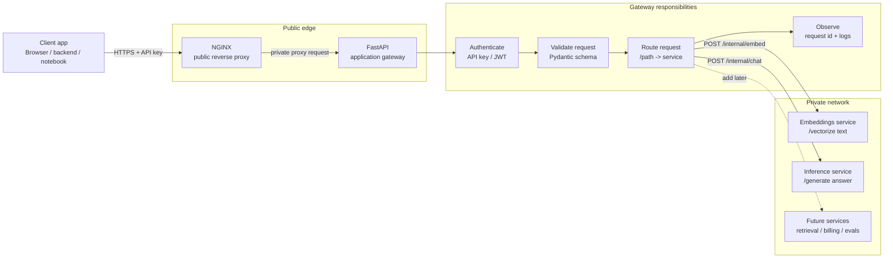

# 01 — API Gateway

An API gateway is the **single public entry point** in front of a set of internal services. Clients do not call the model service, embedding service, retrieval service, or billing logic directly. They call the gateway, and the gateway decides whether the request is allowed, where it should go, and how to shape the response.

For AI applications, the gateway is especially useful because model traffic is expensive, bursty, and usually needs policy checks before it reaches a model provider or self-hosted inference service.

## What problem does it solve?

Without a gateway, every backend service must duplicate the same edge concerns:

- API key validation and tenant lookup.
- Request size checks before a huge prompt reaches an expensive model.
- Routing between `/embeddings`, `/chat`, `/rerank`, `/transcribe`, or retrieval endpoints.
- Consistent timeout, retry, logging, and trace-id behavior.
- Cost controls such as quota checks or handoff to a rate limiter.
- A stable public API even when internal services change.

With a gateway, those concerns sit at the edge and your internal services can stay smaller and more specialized.

## Mental model

Think of the gateway as two cooperating layers: NGINX is the efficient edge reverse proxy, and FastAPI is the programmable application-policy layer.

**Edge** means the outer boundary or layer where traffic from outside enters infrastructure serving your system. Locally, NGINX is the first and only edge component. In production, the edge path might contain DNS, DDoS protection, a CDN, a WAF, and then NGINX. "Edge" describes where a component sits; "reverse proxy" describes what NGINX does.

1. **Receive and protect** the connection at NGINX.
2. **Apply coarse limits** such as request size and per-IP request rate.
3. **Forward** the request and tracing headers to FastAPI.
4. **Identify** the caller from an API key, JWT, session cookie, or mTLS identity.
5. **Validate and apply policy** using normal application code.
6. **Route** to the correct internal service.
7. **Normalize** the response and return it through NGINX.

## Diagram



## Local architecture in this folder

This module includes a barebones NGINX and Python/FastAPI implementation with four containers:

| Container | Purpose | Public? |
| --- | --- | --- |
| `nginx` | Receives public traffic, applies coarse limits, adds forwarding headers, and proxies to FastAPI. | Yes, on `localhost:8080` |
| `gateway` | Validates API keys and payloads, applies application policy, and proxies to internal services. | No, Docker network only |
| `embeddings-service` | Mock internal service that turns text into a deterministic toy embedding. | No, Docker network only |
| `inference-service` | Mock internal service that returns a deterministic toy answer. | No, Docker network only |

The gateway exposes stable public routes:

- `GET /health`
- `POST /v1/embeddings`
- `POST /v1/chat/completions`

The internal services expose private routes:

- `POST /internal/embed`
- `POST /internal/chat`

## Run it locally

From this folder:

```bash
docker compose up --build
```

Then call NGINX, which forwards the request through the FastAPI gateway:

```bash
curl -s http://localhost:8080/health | jq
```

```bash
curl -s http://localhost:8080/v1/embeddings \
  -H 'X-API-Key: dev-key' \
  -H 'Content-Type: application/json' \
  -d '{"input":"api gateways are policy enforcement points"}' | jq
```

```bash
curl -s http://localhost:8080/v1/chat/completions \
  -H 'X-API-Key: dev-key' \
  -H 'Content-Type: application/json' \
  -d '{"message":"Explain gateways in one sentence","model":"toy-model"}' | jq
```

## Files

- `0_readme.md` introduces the purpose and mental model.
- `1_architecture.md` explains the local request flow and responsibility boundaries.
- `2_architecture_scaled.md` shows the production-style topology with a WAF, NGINX, gateway replicas, and shared state.
- `2_terminology.md` groups and defines the important networking and gateway terms.
- `4_detailed_concepts.md` explains upstream pools, connection pools, health checks, failover, and retry safety.
- `worked-example.ipynb` walks through a request and each rejection layer one cell at a time.
- `nginx.conf` contains edge proxying, request limits, forwarding headers, and upstream connection settings.
- `app/gateway.py` contains the gateway and public API.
- `app/embeddings_service.py` contains a mock embeddings backend.
- `app/inference_service.py` contains a mock chat backend.
- `docker-compose.yml` wires the four services together.
- `Dockerfile` and `requirements.txt` build a small reusable Python image for all three services.

## Where this gets more production-like

This deliberately starts small. In a real deployment, the same architecture can evolve into:

- **Edge technology:** NGINX, Envoy, Traefik, a Kubernetes ingress, or a managed cloud gateway.
- **Application gateway:** Keep FastAPI for policy code, or move supported policies into a managed API gateway.
- **Identity:** API keys in Postgres, OAuth/JWT, WorkOS/Auth0/Clerk, or service-to-service mTLS.
- **Rate limiting:** Redis-backed token buckets, Upstash Redis free tier, Dragonfly, or Envoy global rate limit service.
- **Observability:** OpenTelemetry traces, Prometheus metrics, structured logs, and request ids.
- **Deployment:** Docker Compose for learning, Fly.io/Render/Railway for small deployments, or Kubernetes when you need stronger orchestration.

## Key takeaway

The API gateway is not the model. NGINX provides the **traffic-control edge**, while FastAPI provides the **programmable policy layer** that keeps model-facing systems safer, more observable, and easier to change.
