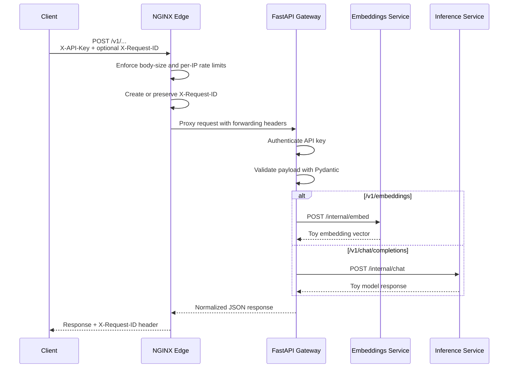
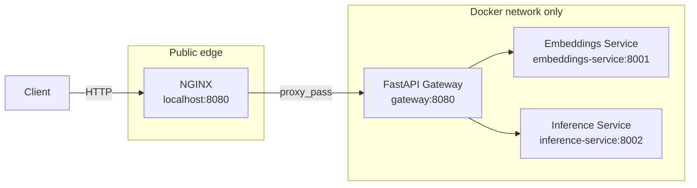

# NGINX and FastAPI Gateway Architecture

The gateway is split into two layers:

- **NGINX edge proxy:** the only public service. It handles connections, coarse protection, forwarding headers, and load balancing.
- **FastAPI application gateway:** a private service. It handles API authentication, JSON validation, application policy, routing, and response shaping.

This split keeps cheap transport-level work out of Python while preserving normal application code for policies that need data models, databases, or business context.

Here, **edge** means the outer boundary or layer where external traffic enters infrastructure serving your system. NGINX is the local edge proxy because it is the first reachable component, not because "edge" is a special type of server.

## Request flow

## Local deployment topology

Only NGINX publishes a host port. The FastAPI gateway and backend services are reachable only inside the Docker network.

## Responsibility boundary

| Concern | NGINX edge | FastAPI gateway |
| --- | --- | --- |
| Public listener | Yes | No |
| TLS termination in production | Yes | No |
| Connection and keep-alive handling | Yes | No |
| Request body-size limit | Yes | Optional second check |
| Coarse per-IP rate limit | Yes | No |
| Load balancing gateway replicas | Yes | No |
| API key or JWT authentication | No | Yes |
| Tenant and model authorization | No | Yes |
| JSON schema validation | No | Yes |
| Route to application services | No | Yes |
| Normalize API responses | No | Yes |
| Token quotas and billing policy | No | Yes, usually with shared state |

NGINX rejects clearly invalid or excessive traffic before it consumes a Python worker. FastAPI performs checks that require understanding the caller or request body.

## Connections and upstreams

Each arrow in the architecture represents a separate network connection. NGINX groups possible FastAPI destinations into an **upstream pool**, while NGINX and FastAPI maintain **connection pools** that reuse open connections.

These concepts, along with health checks and failover behavior, are explained in `4_detailed_concepts.md`.

## Scaling the gateway

NGINX does not make one FastAPI process execute Python faster. It makes horizontal scaling practical by distributing traffic across multiple gateway replicas in an upstream pool.

For that to work safely, gateway replicas must remain stateless:

- Store API keys, tenants, and permissions in a shared database.
- Store distributed rate-limit counters, idempotency keys, and caches in Redis or another shared store.
- Send logs, metrics, and traces to external observability systems.
- Do not rely on one replica's memory for user-visible state.

For streamed AI responses, NGINX buffering must remain disabled and scaling should consider open connections and request duration, not only requests per second.

## Production evolution

On a VM or Docker host, NGINX can remain the public edge and proxy to several FastAPI replicas. On Kubernetes, an ingress or Gateway API implementation usually fills the NGINX role. In Azure, Azure API Management or Container Apps ingress may replace the self-managed NGINX layer.
