# Scaled NGINX and FastAPI Gateway Architecture

This version extends the local NGINX and FastAPI architecture with production infrastructure for many users and bursty API traffic.

The main scaling idea is simple: run multiple stateless FastAPI gateway replicas behind NGINX, and move shared state into external systems.

## Topology

**Layers:** Public entry → Edge proxy replicas → Gateway replicas → Shared state and private services

```mermaid
%%{init: {
    "theme": "base",
    "themeVariables": {
        "fontFamily": "Geist, ui-sans-serif, system-ui, sans-serif",
        "fontSize": "14px",
        "background": "#0b1220",
        "lineColor": "#64748b",
        "textColor": "#e5edf7",
        "primaryTextColor": "#e5edf7",
        "edgeLabelBackground": "#0b1220",
        "clusterBkg": "#111827",
        "clusterBorder": "#334155"
    },
    "flowchart": {
        "curve": "basis",
        "htmlLabels": true,
        "nodeSpacing": 30,
        "rankSpacing": 58,
        "padding": 18
    }
}}%%
flowchart TB
    users("<b>Users</b><br/>public clients")
    dns("<b>DNS</b><br/>api.example.com")
    waf("<b>Managed edge / WAF</b><br/>filters and distributes traffic")

    subgraph proxy[" "]
        direction LR
        n1("<b>NGINX 1</b><br/>edge proxy")
        n2("<b>NGINX 2</b><br/>edge proxy")
    end

    subgraph gateways[" "]
        direction LR
        g1("<b>Gateway 1</b><br/>stateless")
        g2("<b>Gateway 2</b><br/>stateless")
        g3("<b>Gateway 3</b><br/>stateless")
    end

    balance("<b>Load balance</b><br/>across healthy gateways")
    fanout("<b>Each gateway replica</b><br/>connects independently")

    subgraph state[" "]
        direction LR
        auth("<b>Auth DB</b><br/>identity and permissions")
        redis("<b>Redis</b><br/>shared fast state")
    end

    subgraph services[" "]
        direction LR
        embed("<b>Embeddings</b><br/>vectorization")
        infer("<b>Inference</b><br/>model execution")
        retrieval("<b>Retrieval</b><br/>search and RAG")
    end

    obs("<b>Observability</b><br/>logs, metrics, and traces")

    users --> dns --> waf
    waf --> n1
    waf --> n2

    n1 --> balance
    n2 --> balance
    balance --> g1
    balance --> g2
    balance --> g3

    g1 --> fanout
    g2 --> fanout
    g3 --> fanout

    fanout --> auth
    fanout --> redis
    fanout --> embed
    fanout --> infer
    fanout --> retrieval
    fanout -.-> obs

    classDef entryNode fill:#182235,stroke:#64748b,stroke-width:1.5px,color:#e5edf7
    classDef edgeNode fill:#132340,stroke:#60a5fa,stroke-width:1.75px,color:#dbeafe
    classDef gatewayNode fill:#2563eb,stroke:#93c5fd,stroke-width:2px,color:#ffffff
    classDef supportNode fill:#182235,stroke:#64748b,stroke-width:1.5px,color:#e5edf7
    classDef conceptNode fill:#111827,stroke:#60a5fa,stroke-width:1.5px,stroke-dasharray:5 4,color:#bfdbfe
    classDef observeNode fill:#111827,stroke:#64748b,stroke-width:1.5px,stroke-dasharray:5 4,color:#94a3b8

    class users,dns entryNode
    class waf,n1,n2 edgeNode
    class g1,g2,g3 gatewayNode
    class balance,fanout conceptNode
    class auth,redis,embed,infer,retrieval supportNode
    class obs observeNode

    style proxy fill:#0f1d35,stroke:#315a91,stroke-width:1.5px
    style gateways fill:#111827,stroke:#334155,stroke-width:1.5px
    style state fill:#111827,stroke:#334155,stroke-width:1.5px
    style services fill:#111827,stroke:#334155,stroke-width:1.5px

    linkStyle 0,1,2,3 stroke:#60a5fa,stroke-width:2.5px,color:#bfdbfe
```



## Components

- **DNS**: Resolves the public API hostname, such as `api.example.com`, to the edge infrastructure.
- **Managed edge / WAF**: Inspects requests for common web attacks, blocks malicious traffic, and distributes accepted requests across healthy NGINX replicas.
- **NGINX edge proxy replicas**: Part of the edge layer behind the WAF. They manage proxy connections, apply coarse limits, and load balance across healthy FastAPI gateway replicas.
- **FastAPI gateway replicas**: Run the same stateless application-gateway code. Any request should be able to land on any replica.
- **Auth DB**: Stores API keys, tenants, plans, model permissions, and account status.
- **Redis**: Stores fast shared state such as rate-limit counters, short-lived cache entries, idempotency keys, and request coordination locks.
- **Embeddings**: Private service for embedding requests. It can scale independently from the gateway.
- **Inference**: Private service for chat or completion requests. This is usually the expensive bottleneck in AI apps.
- **Retrieval**: Private service for search, vector lookup, or RAG context assembly.
- **Observability**: Receives logs, metrics, traces, request ids, latency, error rates, and per-tenant usage.

## Scaling Notes

- NGINX handles proxy connections, coarse request limits, forwarding headers, and load balancing.
- FastAPI gateways validate, authorize, route, apply application policy, and record metadata.
- Neither NGINX nor FastAPI gateways should perform heavy retrieval, long-running jobs, or model execution.
- Autoscale FastAPI gateway replicas on CPU, memory, latency, request rate, or in-flight requests.
- Run multiple NGINX replicas so one instance is not a single point of failure, and scale them separately from FastAPI.
- Set strict timeouts between NGINX, gateways, and every downstream service.
- Use connection pools so each gateway replica does not create excessive downstream connections.
- Apply coarse limits at NGINX and tenant-aware distributed limits using shared state such as Redis.
- Keep internal services private so clients can only reach them through the gateway.
- For streaming model responses, track in-flight connections as a scaling signal, not just request count.

## Why keep this separate from the local architecture?

The local architecture teaches the request path and responsibility split. This scaled version adds concepts that are unnecessary locally but important in production:

- A WAF before the edge proxy.
- Multiple FastAPI gateway replicas.
- Shared authentication and rate-limit state.
- Independent scaling of NGINX, gateways, and application services.
- Centralized observability.

## Connection pool capacity at scale

Each NGINX and FastAPI replica has its own connection pools. Adding replicas therefore increases the total number of possible downstream connections.

For example:

```text
3 FastAPI replicas x 50 connections per replica = up to 150 downstream connections
```

This is useful when downstream services can handle the concurrency, but dangerous when a database, model server, or external provider has a lower connection limit. Pool sizes should be planned across all replicas, not considered one replica at a time.

The trade-off is:

- Pools that are too small cause requests to wait and increase latency.
- Pools that are too large consume resources and can overload downstream services.
- Idle and request timeouts release connections that are no longer useful.
