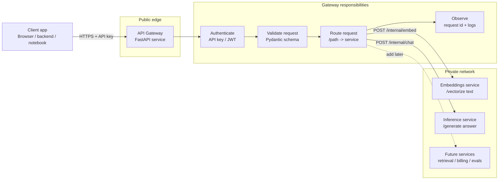

# 01 — API Gateway

An API gateway is the **single public entry point** in front of a set of internal services. Clients do not call the model service, embedding service, retrieval service, or billing logic directly. They call the gateway, and the gateway decides whether the request is allowed, where it should go, and how to shape the response.

For AI applications, the gateway is especially useful because model traffic is expensive, bursty, and usually needs policy checks before it reaches a model provider or self-hosted inference service.

## What problem does it solve?

Without a gateway, every backend service must duplicate the same edge concerns:

- API key validation and tenant lookup.
- Request size checks before a huge prompt reaches an expensive model.
- Routing between `/embeddings`, `/chat`, `/rerank`, `/transcribe`, or retrieval endpoints.
- Consistent timeout, retry, logging, and trace-id behavior.
- Cost controls such as quota checks or handoff to a rate limiter.
- A stable public API even when internal services change.

With a gateway, those concerns sit at the edge and your internal services can stay smaller and more specialized.

## Mental model

Think of the gateway as a programmable reverse proxy:

1. **Receive** the client request.
2. **Identify** the caller from an API key, JWT, session cookie, or mTLS identity.
3. **Validate** the request body before forwarding it.
4. **Apply policy** such as max prompt length, allowed model, tenant quota, or rate-limit check.
5. **Route** to the correct internal service.
6. **Normalize** errors and attach observability metadata such as a request id.
7. **Return** a stable response shape to the caller.

## Diagram



## Local architecture in this folder

This module includes a barebones Python/FastAPI implementation with three containers:

| Container | Purpose | Public? |
| --- | --- | --- |
| `gateway` | Receives client traffic, validates API keys, validates payloads, and proxies to internal services. | Yes, on `localhost:8080` |
| `embeddings-service` | Mock internal service that turns text into a deterministic toy embedding. | No, Docker network only |
| `inference-service` | Mock internal service that returns a deterministic toy answer. | No, Docker network only |

The gateway exposes stable public routes:

- `GET /health`
- `POST /v1/embeddings`
- `POST /v1/chat/completions`

The internal services expose private routes:

- `POST /internal/embed`
- `POST /internal/chat`

## Run it locally

From this folder:

```bash
docker compose up --build
```

Then call the gateway:

```bash
curl -s http://localhost:8080/health | jq
```

```bash
curl -s http://localhost:8080/v1/embeddings \
  -H 'X-API-Key: dev-key' \
  -H 'Content-Type: application/json' \
  -d '{"input":"api gateways are policy enforcement points"}' | jq
```

```bash
curl -s http://localhost:8080/v1/chat/completions \
  -H 'X-API-Key: dev-key' \
  -H 'Content-Type: application/json' \
  -d '{"message":"Explain gateways in one sentence","model":"toy-model"}' | jq
```

## Files

- `architecture.md` explains the request flow and deployment topology in more detail.
- `app/gateway.py` contains the gateway and public API.
- `app/embeddings_service.py` contains a mock embeddings backend.
- `app/inference_service.py` contains a mock chat backend.
- `docker-compose.yml` wires the three services together.
- `Dockerfile` and `requirements.txt` build a small reusable Python image for all three services.

## Where this gets more production-like

This deliberately starts small. In a real deployment, the same architecture can evolve into:

- **Gateway technology:** FastAPI, Kong, Envoy, NGINX, Traefik, Caddy, or an API gateway managed by your cloud provider.
- **Identity:** API keys in Postgres, OAuth/JWT, WorkOS/Auth0/Clerk, or service-to-service mTLS.
- **Rate limiting:** Redis-backed token buckets, Upstash Redis free tier, Dragonfly, or Envoy global rate limit service.
- **Observability:** OpenTelemetry traces, Prometheus metrics, structured logs, and request ids.
- **Deployment:** Docker Compose for learning, Fly.io/Render/Railway for small deployments, or Kubernetes when you need stronger orchestration.

## Key takeaway

The API gateway is not the model. It is the **traffic control and policy layer** that keeps model-facing systems safer, more observable, and easier to change.
