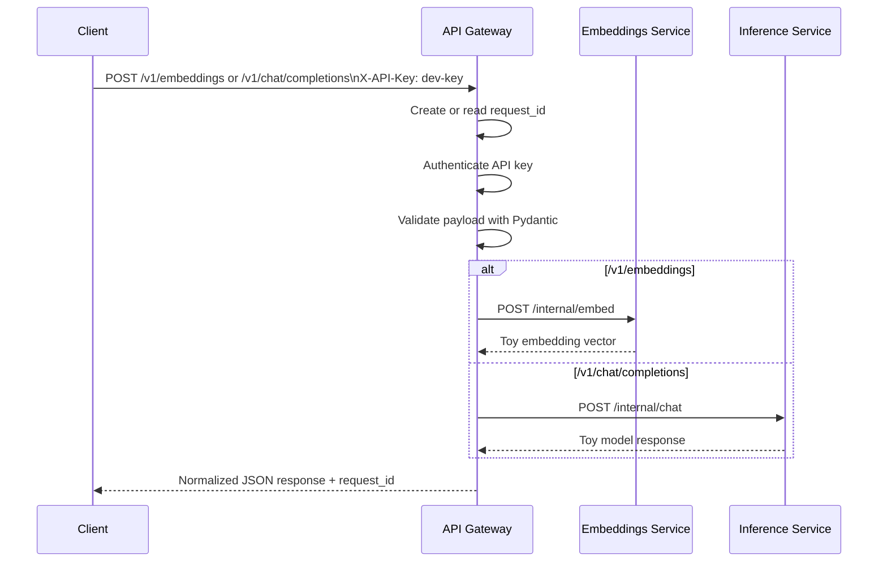
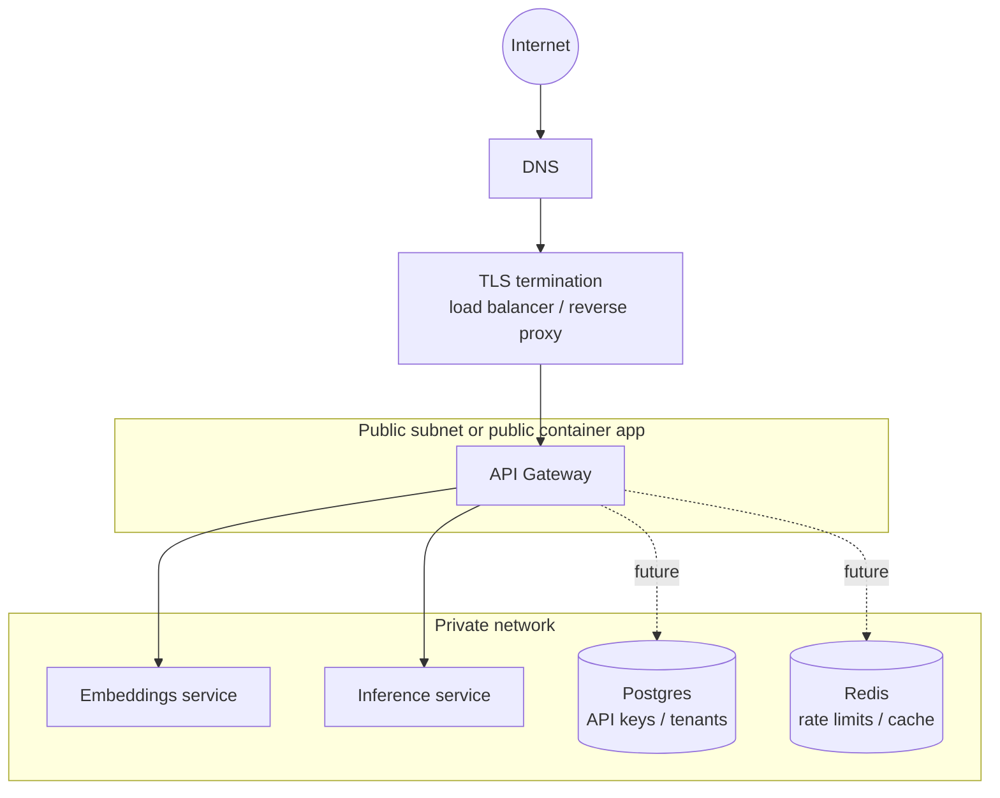

# API Gateway Architecture

## Request flow

## Deployment topology

## What belongs in the gateway?

Good gateway responsibilities:

- Authentication and caller identification.
- Basic authorization such as whether a caller can access a model family.
- Request body validation and maximum size checks.
- Routing to internal services.
- Request ids, logging, metrics, and trace propagation.
- Consistent error responses.
- Handoff to dedicated rate-limit, cache, and billing systems.

Responsibilities to avoid putting in the gateway:

- Long-running model jobs.
- Heavy retrieval or vector search logic.
- Complex business workflows.
- Training jobs or batch processing.
- Anything that makes the gateway a bottleneck or single giant application.

## Why internal services are private

The embeddings and inference services are intentionally not exposed to the host in `docker-compose.yml`. Only the gateway binds a host port. This mirrors production: internal services should usually be reachable only from trusted infrastructure, not from arbitrary clients.

## Why use barebones FastAPI here?

FastAPI is not the only way to build a gateway. It is useful for learning because you can see each gateway mechanism as normal Python code:

- Header parsing for API keys.
- Pydantic models for validation.
- `httpx` calls for service-to-service proxying.
- Consistent response wrapping.

Once the mechanics are clear, the same ideas transfer to Kong, Envoy, NGINX, Traefik, cloud API gateways, or Kubernetes ingress controllers.
