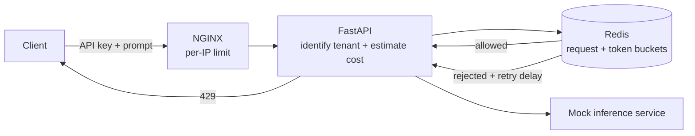

# 02 - Rate Limiting

Rate limiting controls how much work a caller may ask a system to perform during a period of time. For an AI API, this is both an availability control and a financial control: each accepted request may consume tokens, model-provider quota, GPU time, or several expensive downstream calls.

## What problem does it solve?

Without rate limiting, one client, accidental retry loop, or abusive caller can:

- Consume all available inference concurrency.
- Create a denial-of-wallet incident through model-provider spend.
- Starve other tenants even when their normal traffic is small.
- Trigger downstream provider limits and cascading retries.
- Fill queues faster than workers can drain them.

A useful AI rate limiter does more than count HTTP requests. A short embedding request and a long generation request do not have the same cost, so this module limits both **request rate** and **estimated token usage**.

## Interview prompt

> How would you prevent one tenant or a misconfigured client from exhausting the budget and capacity of an LLM API?

A strong answer distinguishes coarse edge protection from identity-aware application limits, explains the limiting algorithm and shared state, and describes what the client receives when a request is rejected.

## Mental model

This example uses two cooperating layers:

1. **NGINX applies a coarse per-IP limit.** It cheaply rejects obvious traffic floods before they consume a Python worker.
2. **FastAPI authenticates the tenant and estimates request cost.**
3. **Redis atomically checks two token buckets:** one for request units and one for model-token units.
4. **Allowed requests reach the mock inference service.**
5. **Rejected requests receive `429 Too Many Requests` and a `Retry-After` hint.**



## Local policies

The defaults are deliberately small so the behavior is easy to observe:

| Policy | Capacity | Refill rate | Cost per request |
| --- | ---: | ---: | ---: |
| Tenant request bucket | 5 request units | 1 unit/second | 1 |
| Tenant token bucket | 100 token units | 20 units/second | Estimated prompt tokens + requested output tokens |
| Edge IP limit | 20 requests/second | NGINX-managed | 1 |

The token estimate is intentionally simple: approximately one token per four characters, plus the requested `max_tokens`. A production gateway should use the target model's tokenizer or reserve and reconcile usage using the provider's returned token counts.

If one request's estimated cost exceeds the entire token-bucket capacity, the gateway returns `422 Unprocessable Entity`. Waiting cannot make a request larger than the maximum burst become admissible.

## Run it locally

From this folder:

```bash
docker compose up --build
```

Make an inexpensive request:

```bash
curl -i http://localhost:8081/v1/chat/completions \
  -H 'X-API-Key: dev-key' \
  -H 'Content-Type: application/json' \
  -d '{"message":"Explain token buckets briefly.","max_tokens":20}'
```

Repeat it quickly to exhaust the request bucket:

```bash
for i in 1 2 3 4 5 6 7; do
  curl -s -o /dev/null -w "request=$i status=%{http_code}\n" \
    http://localhost:8081/v1/chat/completions \
    -H 'X-API-Key: dev-key' \
    -H 'Content-Type: application/json' \
    -d '{"message":"small request","max_tokens":5}'
done
```

Use `team-key` to observe that limits are isolated by tenant:

```bash
curl -i http://localhost:8081/v1/chat/completions \
  -H 'X-API-Key: team-key' \
  -H 'Content-Type: application/json' \
  -d '{"message":"This tenant has separate buckets.","max_tokens":20}'
```

Reset the learning environment:

```bash
docker compose exec redis redis-cli FLUSHDB
```

## Files

- `0_readme.md` introduces the purpose, AI-specific cost model, and runnable example.
- `1_architecture.md` explains the local request flow and responsibility boundaries.
- `2_architecture_scaled.md` extends the design to multiple regions and provider quotas.
- `3_terminology.md` defines the important rate-limiting terms.
- `4_detailed_concepts.md` explains token buckets, atomicity, key design, and failure policy.
- `5_worked_example.ipynb` walks through requests, Redis bucket state, lazy refill, rejection, and tenant isolation.
- `app/gateway.py` authenticates callers, estimates cost, and enforces both Redis buckets.
- `app/inference_service.py` represents expensive downstream model work.
- `app/token_bucket.lua` performs the two-bucket decision atomically in Redis.
- `nginx.conf` applies the coarse per-IP edge limit.
- `docker-compose.yml` runs NGINX, FastAPI, Redis, and the mock inference service.

## Key takeaway

For AI APIs, **requests per minute is necessary but insufficient**. Rate limits should reflect the resource being protected: token spend, concurrent generations, GPU capacity, provider quota, or queued work.

## Source and further reading

- Curriculum inspiration: [System Design for AI Engineers: 7 patterns you should know in your interviews](https://jamwithai.substack.com/p/system-design-for-ai-engineers-7)
- [Redis: Rate limiting](https://redis.io/redis-best-practices/basic-rate-limiting/)
