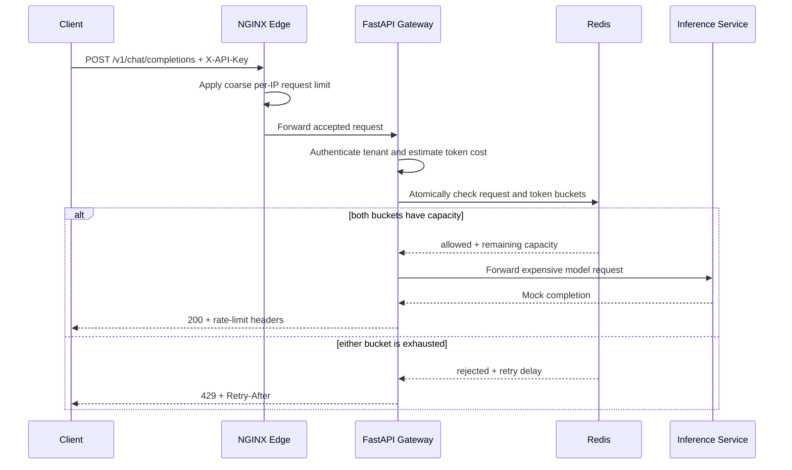
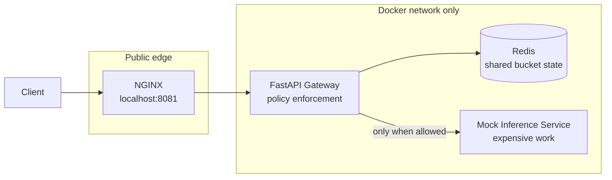

# Rate-Limiting Architecture

## Request flow



## Local deployment topology



Only NGINX publishes a host port. Redis, the gateway, and the inference service remain private.

## Responsibility boundary

| Concern | NGINX edge | FastAPI gateway | Redis |
| --- | --- | --- | --- |
| Cheap per-IP flood protection | Yes | No | No |
| Authenticate API key and identify tenant | No | Yes | No |
| Estimate AI request cost | No | Yes | No |
| Store shared limiter state | No | No | Yes |
| Make an atomic multi-bucket decision | No | Initiates | Executes |
| Return tenant-aware limit headers | No | Yes | No |
| Protect downstream inference work | Indirectly | Yes | No |

## Why two limiting layers?

An IP address is available before authentication and is cheap to inspect, but it is a weak identity. Many legitimate users may share one IP, and an abusive caller may rotate IPs.

An authenticated tenant is a stronger policy key, but checking it requires application work and shared state. The two layers protect different resources:

```text
Internet flood
  -> coarse IP limiter protects edge and gateway capacity
     -> tenant request/token limiter protects fairness and AI spend
        -> inference service performs allowed work
```

## Why Redis?

An in-memory limiter inside FastAPI would work with one process, but every additional process or replica would have an independent view of remaining capacity. Redis provides shared state and executes the decision script atomically, so concurrent gateway replicas cannot spend the same remaining tokens.

Redis is a practical default for this example because the limiter state is small, frequently updated, latency-sensitive, and temporary. It is not the only valid choice:

| Option | When it fits |
| --- | --- |
| **Redis** | Low-latency shared counters or buckets with atomic scripts and automatic expiry. |
| **DynamoDB** | Serverless AWS systems that prefer managed durability and can design around conditional updates and partition limits. |
| **PostgreSQL** | Lower-throughput systems that want to reuse an existing database and value transactional integration over minimum latency. |
| **Managed API gateway** | Teams that want common edge limits handled by their cloud or gateway provider with minimal custom infrastructure. |
| **Dedicated rate-limiting service** | Larger platforms that need centralized policy, multiple algorithms, consistent enforcement, and specialized operations. |

The detailed trade-offs are covered in `4_detailed_concepts.md`.

## Response behavior

Allowed responses include remaining request and token capacity:

```http
X-RateLimit-Request-Remaining: 4
X-RateLimit-Token-Remaining: 63
```

Rejected responses include the binding limit and an approximate delay:

```http
HTTP/1.1 429 Too Many Requests
Retry-After: 2
X-RateLimit-Limit-Type: tokens
```

The client should wait before retrying and add jitter when many workers may retry together.
