# Scaled Rate-Limiting Architecture

The local example has one gateway and one Redis instance. At production scale, rate limiting becomes a consistency, latency, and product-policy problem.

**Layers:** Public entry → Global routing → Regional enforcement → Model capacity and durable control systems

```mermaid
%%{init: {
    "theme": "base",
    "themeVariables": {
        "fontFamily": "Geist, ui-sans-serif, system-ui, sans-serif",
        "fontSize": "14px",
        "background": "#0b1220",
        "lineColor": "#64748b",
        "textColor": "#e5edf7",
        "primaryTextColor": "#e5edf7",
        "edgeLabelBackground": "#0b1220",
        "clusterBkg": "#111827",
        "clusterBorder": "#334155"
    },
    "flowchart": {
        "curve": "basis",
        "htmlLabels": true,
        "nodeSpacing": 34,
        "rankSpacing": 62,
        "padding": 18
    }
}}%%
flowchart TB
    clients("<b>Clients</b><br/>public callers") --> edge("<b>CDN / WAF</b><br/>coarse edge limits")
    edge --> router("<b>Global traffic routing</b><br/>selects a healthy region")

    subgraph regions[" "]
        direction LR
        regionA("<b>Region A gateways</b><br/>tenant-aware enforcement")
        regionB("<b>Region B gateways</b><br/>tenant-aware enforcement")
    end

    subgraph fastState[" "]
        direction LR
        redisA("<b>Regional Redis A</b><br/>short-lived limiter state")
        redisB("<b>Regional Redis B</b><br/>short-lived limiter state")
    end

    provider("<b>Model provider / GPU fleet</b><br/>protected expensive capacity")
    control("<b>Policy service</b><br/>plans, quotas, and overrides")
    usage("<b>Usage ledger</b><br/>billing, audit, and reconciliation")

    router --> regionA
    router --> regionB

    regionA --> redisA
    regionB --> redisB

    regionA --> provider
    regionB --> provider

    control -. publishes policy .-> regionA
    control -. publishes policy .-> regionB
    usage <-. async usage events .-> regionA
    usage <-. async usage events .-> regionB

    classDef entryNode fill:#182235,stroke:#64748b,stroke-width:1.5px,color:#e5edf7
    classDef edgeNode fill:#132340,stroke:#60a5fa,stroke-width:1.75px,color:#dbeafe
    classDef regionNode fill:#2563eb,stroke:#93c5fd,stroke-width:2px,color:#ffffff
    classDef supportNode fill:#182235,stroke:#64748b,stroke-width:1.5px,color:#e5edf7
    classDef asyncNode fill:#111827,stroke:#64748b,stroke-width:1.5px,stroke-dasharray:5 4,color:#94a3b8

    class clients entryNode
    class edge,router edgeNode
    class regionA,regionB regionNode
    class redisA,redisB,provider supportNode
    class control,usage asyncNode

    style regions fill:#111827,stroke:#334155,stroke-width:1.5px
    style fastState fill:#111827,stroke:#334155,stroke-width:1.5px

    linkStyle 0,1,2,3 stroke:#60a5fa,stroke-width:2.5px,color:#bfdbfe
```

## Separate fast enforcement from durable accounting

The synchronous limiter must answer quickly, so Redis or an equivalent low-latency store holds short-lived enforcement state. A durable usage ledger separately records actual model usage for billing, audit, and reconciliation.

Do not treat expiring Redis bucket state as the billing source of truth.

## Regional versus global limits

One global Redis deployment gives a stronger global limit but adds cross-region latency and creates a large failure domain. Regional limiters are faster and more resilient, but a tenant may temporarily consume its allowance in every region.

Common approaches include:

- Allocate part of a global allowance to each region.
- Route each tenant to a home region.
- Enforce short-window limits regionally and reconcile longer quotas globally.
- Accept bounded overshoot in exchange for availability.

## Multiple protected resources

A production AI platform may enforce several policies:

| Resource | Example policy key | Useful unit |
| --- | --- | --- |
| Edge capacity | IP or network | Requests/second |
| Tenant fairness | Tenant and endpoint | Requests/minute |
| Model spend | Tenant and model | Input/output tokens/minute |
| Provider quota | Provider account and model | Provider RPM/TPM |
| GPU capacity | Model pool | Concurrent requests or weighted work |
| Async processing | Tenant and job type | Queue submissions/minute |
| Commercial allowance | Organization and billing period | Dollars or tokens/month |

## Failure behavior

The limiter's dependency can fail too. Choose a policy per route:

- **Fail closed:** reject requests when the limiter is unavailable. Protects spend and capacity but reduces availability.
- **Fail open:** allow requests when the limiter is unavailable. Preserves availability but risks overload and cost.
- **Local emergency limit:** temporarily apply a conservative in-process limit while shared state is unavailable.

High-cost generation routes usually lean toward fail closed or a conservative emergency limit. Low-cost health and metadata routes should not depend on the limiter.
