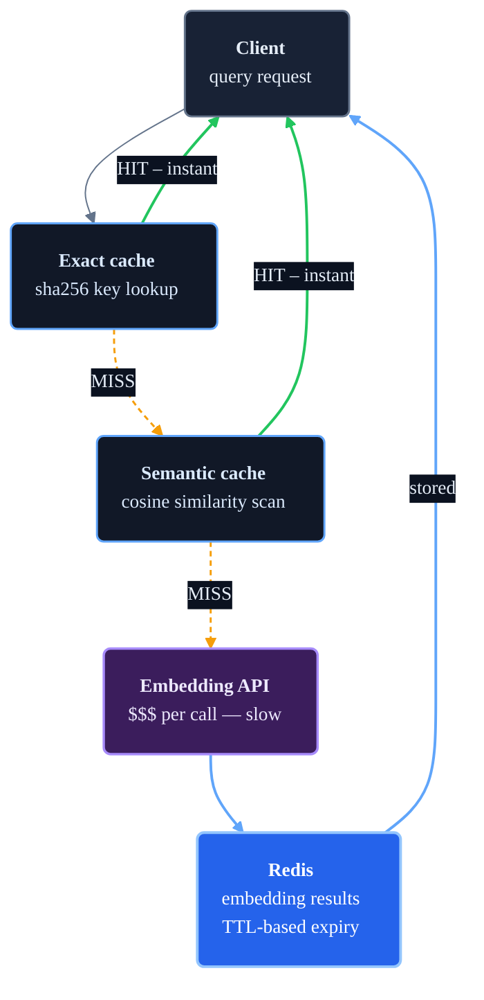

# 03 - Caching for RAG Systems

Caching stores computed results so repeated requests skip redundant work. A RAG pipeline has several cacheable layers — and choosing the right one to cache matters more than implementing the cache itself.

## Where to cache in a RAG pipeline

```text
Layer                  Cost saved per hit   Staleness risk   When it pays off
──────────────────────────────────────────────────────────────────────────────
Full LLM response      $$$  + 5–30 s        High             FAQ bots, repeated prompts
Retrieved chunks       $$   + 1–3 s         Medium           Stable corpora, common queries
Query embedding        $    + 50–500 ms      Low              High-volume identical queries
Document embedding     $$$  at index time    Low              Re-indexing unchanged docs
Provider prefix cache  $    (handled for you) —              Long repeated system prompts
```

**Full response caching** is the highest-value target. It short-circuits the entire pipeline — embedding, retrieval, and generation — in one hit. [GPTCache](https://github.com/zilliztech/GPTCache) is the most widely used open-source library for this.

**Provider-level prefix caching** handles another large slice at no extra effort. Anthropic caches prompt prefixes server-side when you mark them with `cache_control`; OpenAI caches prompt prefixes implicitly. For a RAG system with a large fixed system prompt or document block, this alone can cut token costs by 50–90 % on repeated queries without any infrastructure changes.

**Query embedding caching** — what this module demonstrates — has a narrower fit. Embedding APIs are cheap ($0.02/million tokens on `text-embedding-3-small`) and fast (50–200 ms). The ROI is real but modest, and it only materialises when query repetition is high. Most RAG deployments — internal enterprise search, document Q&A, diverse user populations — have low repetition and see little benefit.

**Document embedding caching** matters significantly at ingestion time: don't re-embed unchanged documents when you update the corpus.

## Why this module still teaches embedding caching

The two-level cache pattern (exact hash → semantic ANN search) and the mechanics — cosine similarity, TTL, semantic promotion, Qdrant — appear at every layer. Learning them here, where the scope is small and the feedback loop is fast, prepares you to apply the same pattern to full response caching or retrieval caching where the stakes are higher.

## The problem

Every embedding API call costs ~500 ms and money. Without a cache, identical or near-identical queries each pay that cost. With one, repeated queries return in single-digit milliseconds from Redis.

## Two cache levels

**Exact match** — hash the normalized query string. On a hit, return the stored embedding immediately.
- Key: `sha256(normalize(query))`, O(1) lookup

**Semantic match** — if exact misses, compare the query embedding against stored embeddings via cosine similarity. Return the closest match if it exceeds a threshold.
- Cost: O(n) scan, threshold default 0.97
- Covers natural-language variation: "how to reset my password" ≈ "steps to reset password"

## Flow



## Local config

| Setting | Default | Purpose |
| --- | ---: | --- |
| Embedding API latency | 500 ms | Simulates a real API call |
| Cache TTL | 3600 s | Entries expire after one hour |
| Semantic similarity threshold | 0.97 | Minimum cosine similarity for a hit |
| Embedding dimensions | 8 | Small for easy inspection |

## Run locally

```bash
docker compose up --build
```

```bash
# Cache miss
curl -s -X POST http://localhost:8081/v1/embeddings \
  -H 'Content-Type: application/json' \
  -d '{"query": "how to reset my password"}' | python3 -m json.tool

# Exact hit (repeat same query)
curl -s -X POST http://localhost:8081/v1/embeddings \
  -H 'Content-Type: application/json' \
  -d '{"query": "how to reset my password"}' | python3 -m json.tool

# Semantic hit (similar wording)
curl -s -X POST http://localhost:8081/v1/embeddings \
  -H 'Content-Type: application/json' \
  -d '{"query": "steps to reset password"}' | python3 -m json.tool

# Stats
curl -s http://localhost:8081/cache/stats | python3 -m json.tool

# Inspect Redis
docker compose exec redis redis-cli KEYS 'cache:*'
docker compose exec redis redis-cli SMEMBERS cache:semantic:index

# Reset
curl -X DELETE http://localhost:8081/cache
```

## Files

| File | Contents |
| --- | --- |
| `1_architecture.md` | Local request flow and component responsibilities |
| `2_architecture_scaled.md` | Production-scale design with vector DBs and distributed caches |
| `3_terminology.md` | Key caching terms |
| `4_detailed_concepts.md` | TTL strategy, eviction policies, failure modes |
| `5_worked_example.ipynb` | Walkthrough: misses, hits, Redis inspection, hit-rate measurement |
| `app/gateway.py` | Two-level cache check with fallthrough to embedding API |
| `app/embedding_service.py` | Mock embedding API with configurable latency |
| `docker-compose.yml` | Gateway + mock service + Redis |

## Further reading

- [System Design for AI Engineers: 7 patterns](https://jamwithai.substack.com/p/system-design-for-ai-engineers-7)
- [Redis caching patterns](https://redis.io/redis-best-practices/introduction/)
- [GPTCache — open-source semantic cache for LLMs](https://github.com/zilliztech/GPTCache)
