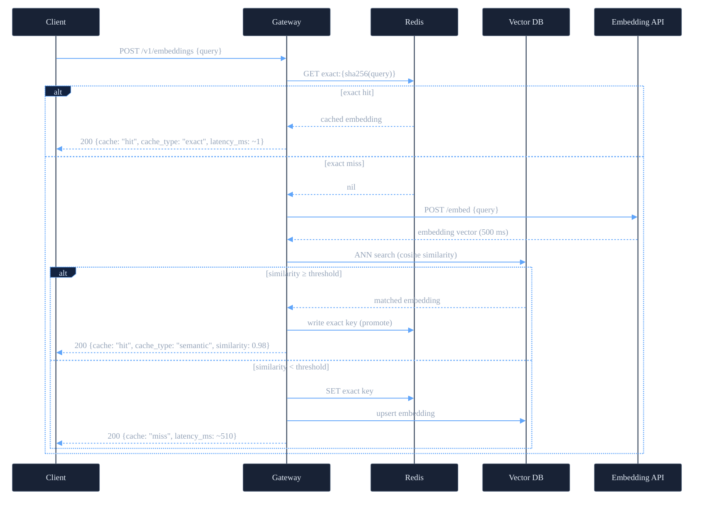

# Caching Architecture

## Request flow



Redis handles exact lookups (O(1) key-value). The vector DB handles semantic search — Redis cannot compute similarity over stored vectors without the RediSearch module.

## Why two cache levels?

A single exact-match cache handles repeated identical queries. For a support chatbot or search interface, many users ask the same intent with different words. Semantic matching extends coverage to near-duplicates without another API call.

```text
User A: "how to reset my password"           → MISS → API call → stored
User B: "steps to reset password"            → exact MISS → semantic HIT (0.98)
User C: "forgot my password, what do I do?"  → exact MISS → semantic HIT (0.97)
User D: "how do I cancel my subscription?"   → exact MISS → semantic MISS → API call
```

## Semantic cache promotion

On a semantic hit, the gateway also writes an exact key for the new query string. The next identical request from that user resolves in O(1) without touching the vector DB.

```text
First:  exact MISS → semantic HIT → write exact key
Second: exact HIT
```

## Cache key design

```text
Exact key:  exact:{sha256(strip(lower(query)))}
Vector DB:  embedding stored with query text as metadata
```

## What the response looks like

Exact hit:

```json
{ "cache": "hit", "cache_type": "exact", "latency_ms": 1.2 }
```

Semantic hit:

```json
{ "cache": "hit", "cache_type": "semantic", "similarity": 0.9812, "matched_query": "how to reset my password", "latency_ms": 8.4 }
```

Miss:

```json
{ "cache": "miss", "latency_ms": 513.7 }
```
