# Scaled Caching Architecture

The local example uses an in-process semantic scan and a single Redis instance. At production scale, each of those choices becomes a bottleneck.

**Layers:** Public entry → Cache tier → Embedding fleet → Retrieval and generation

```mermaid
%%{init: {
    "theme": "base",
    "themeVariables": {
        "fontFamily": "Geist, ui-sans-serif, system-ui, sans-serif",
        "fontSize": "14px",
        "background": "#0b1220",
        "lineColor": "#64748b",
        "textColor": "#e5edf7",
        "primaryTextColor": "#e5edf7",
        "edgeLabelBackground": "#0b1220",
        "clusterBkg": "#111827",
        "clusterBorder": "#334155"
    },
    "flowchart": {
        "curve": "basis",
        "htmlLabels": true,
        "nodeSpacing": 34,
        "rankSpacing": 62,
        "padding": 18
    }
}}%%
flowchart TB
    clients("<b>Clients</b>")
    gateways("<b>Gateway replicas</b><br/>normalize, hash, route")

    subgraph cacheLayer[" Cache tier "]
        direction LR
        exactCache("<b>Redis cluster</b><br/>exact-match cache<br/>string key → embedding JSON")
        vectorDB("<b>Vector database</b><br/>semantic cache<br/>ANN index over stored embeddings")
    end

    embedFleet("<b>Embedding service fleet</b><br/>expensive API calls — only on full miss")
    vectorStore("<b>Document vector store</b><br/>retrieved chunks for RAG")
    llm("<b>LLM</b><br/>generation")
    usageLog("<b>Usage log</b><br/>async — billing and analytics")

    clients --> gateways
    gateways -->|1. exact lookup| exactCache
    exactCache -->|HIT| gateways
    gateways -->|2. semantic lookup on exact miss| vectorDB
    vectorDB -->|HIT above threshold| gateways
    gateways -->|3. full miss| embedFleet
    embedFleet --> exactCache
    embedFleet --> vectorDB
    gateways --> vectorStore
    vectorStore --> llm
    llm --> clients
    gateways -. usage event .-> usageLog

    classDef entryNode fill:#182235,stroke:#64748b,stroke-width:1.5px,color:#e5edf7
    classDef focusNode fill:#2563eb,stroke:#93c5fd,stroke-width:2px,color:#ffffff
    classDef cacheNode fill:#111827,stroke:#60a5fa,stroke-width:1.5px,color:#dbeafe
    classDef costNode fill:#3b1d5c,stroke:#a78bfa,stroke-width:1.75px,color:#ede9fe
    classDef asyncNode fill:#182235,stroke:#64748b,stroke-width:1.5px,stroke-dasharray:5 4,color:#94a3b8

    class clients,vectorStore,llm entryNode
    class gateways focusNode
    class exactCache,vectorDB cacheNode
    class embedFleet costNode
    class usageLog asyncNode

    style cacheLayer fill:#111827,stroke:#334155,stroke-width:1.5px
```

## Exact cache at scale

Redis Cluster shards keys across nodes. The exact-match cache is a simple key-value lookup — it scales horizontally with minimal coordination. A single-digit millisecond latency is achievable even under heavy load.

Managed options (ElastiCache, Upstash, Redis Cloud) handle replication, failover, and persistence without infrastructure work.

## Semantic cache at scale: replace the linear scan

The local example iterates over all cached embeddings in Python. At thousands of entries, this scan becomes the bottleneck. In production, move semantic lookup to a dedicated approximate-nearest-neighbour (ANN) index:

| Store | Notable option | Notes |
| --- | --- | --- |
| **Redis with RediSearch** | `FT.SEARCH` with vector field | Adds vector search to existing Redis without a new service |
| **Pinecone** | Managed serverless | Fully managed, no infrastructure, pay-per-query |
| **Qdrant** | Self-hosted or managed | Open source, strong filtering, efficient on-disk indexes |
| **pgvector** | PostgreSQL extension | Reuses existing Postgres if embedding volume is moderate |
| **Weaviate** | Self-hosted or managed | Schema-based, supports hybrid keyword + vector search |

ANN indexes find the nearest neighbours in sub-millisecond time at millions of vectors, far faster than a linear scan.

## Threshold selection

The semantic similarity threshold controls the precision-recall trade-off for cache hits:

| Threshold | Effect |
| --- | --- |
| Too high (> 0.99) | Very few semantic hits — only catches minor variations |
| Good range (0.95–0.98) | Catches natural-language paraphrases of the same intent |
| Too low (< 0.90) | Returns cached embeddings for unrelated queries — incorrect results |

The right value depends on your embedding model, query distribution, and acceptable error rate. Measure it against a labeled evaluation set.

## Cache invalidation

TTL-based expiry handles most cases: stale entries expire and the next miss repopulates the cache with fresh data.

Harder cases:

- **Document corpus updates:** if indexed documents change, cached embeddings for queries that matched those documents may return stale retrieval results. A document-level invalidation signal (webhook, changelog event) can purge related cache entries.
- **Model updates:** switching embedding model versions makes all cached vectors incompatible. Namespace cache keys by model version (e.g., `cache:v2:embedding:exact:…`) so old and new entries coexist during rollout.
- **Manual override:** a `/cache` DELETE endpoint or targeted key removal handles urgent invalidation.

## Shared versus local cache

A shared Redis cluster is the default because gateway replicas benefit from each other's misses: User A on replica 1 populates the cache; User B on replica 2 gets a hit.

A local in-memory cache per replica (e.g., Python `functools.lru_cache`) is faster but warms independently and does not survive restarts. Using both — local L1 for the most frequent queries and shared Redis as L2 — is the cache hierarchy pattern common in production systems.

## Cache warming

A cold cache after a deploy or incident means many consecutive misses. Strategies to pre-warm:

- Replay the top-N most frequent queries from the usage log before switching traffic.
- Pre-compute and load embeddings for a fixed set of known-common queries at startup.
- Route a small fraction of traffic to the new cache before full cutover.

## Observability

Track at minimum:

| Metric | Why it matters |
| --- | --- |
| Exact hit rate | Measures repeated-query coverage |
| Semantic hit rate | Measures paraphrase coverage |
| Miss rate | Measures API calls and cost exposure |
| Semantic scan latency (p99) | Catches linear-scan growth before it hurts users |
| Cache entry count | Tracks growth and memory pressure |
| Eviction count | Signals that the cache is full and entries are being dropped |

## Failure behavior

If Redis is unavailable:

- **Fail open:** pass all requests to the embedding API. Service degrades gracefully but cost and latency spike.
- **Circuit breaker:** detect the Redis failure quickly, stop attempting cache lookups, and route directly to the embedding API until Redis recovers. Combine with a rate limit to cap spend during the outage.

Embedding API failures are a separate concern; apply retries with backoff and a circuit breaker independently.
