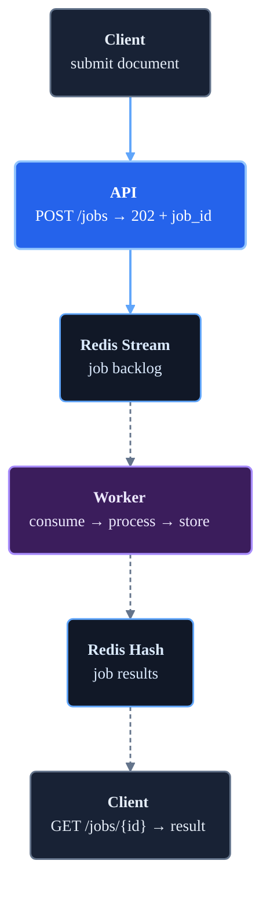

# 04 - Message Queues for AI Systems

LLM inference takes 1–30 seconds. HTTP clients time out. Message queues fix this by decoupling fast job submission from slow processing.

## The core problem

A synchronous LLM API call blocks the HTTP connection for the full inference duration:

```text
Client → POST /complete → [waits 15 s] → response

Problems:
- Client must hold connection open — timeouts at load balancers and proxies
- Burst traffic overwhelms the inference fleet
- A single slow generation blocks a thread
- No retry if the worker crashes mid-inference
```

A queue converts this into an async pattern:

```text
Client → POST /jobs    → 202 + job_id   (< 10 ms)
Client → GET /jobs/123 → 200 + result   (poll after delay)

Benefits:
- Fast response to the client
- Inference happens at the rate workers can sustain
- Burst traffic queues rather than failing
- A crashed worker does not lose the job
```

## When to build a queue vs use a provider API

All queue use cases in AI share the same shape: producer → queue → worker → result. The question is whether you build the queue or use one the provider built for you.

| Workload | Who builds the queue | Notes |
| --- | --- | --- |
| Real-time LLM inference (interactive) | **You** — this module | Users submit jobs; your API queues them; workers call the LLM |
| Offline batch LLM inference | **Provider** — Anthropic Batch API, OpenAI Batch API | Submit a JSONL file; poll for results; 50 % cheaper |
| Offline batch embedding | **Provider** — same batch APIs | Same pattern, embedding models instead of chat models |
| Document ingestion (parse, chunk, store) | **You** | Provider has no concept of your document pipeline |
| Async model evaluation | **You** | Scoring your own outputs is always your job |

**Rule of thumb:** if the slow work is a call to a provider model and latency tolerance is high (minutes to hours), use their batch API. If the slow work involves your own infrastructure, or users need results in seconds rather than hours, build the queue yourself.

## The problem this module demonstrates

Clients submit documents for LLM summarisation. The model takes 2–10 seconds per document. Without a queue, a burst of 50 documents exhausts the thread pool and causes timeouts. With a queue, each document becomes a job that workers process at a sustainable rate.

## Request flow



## Local config

| Setting | Default | Purpose |
| --- | ---: | --- |
| Worker processing time | 2 s (simulated) | Simulates LLM inference latency |
| Redis Stream name | `jobs:pending` | Queue where the API writes jobs |
| Consumer group | `workers` | Redis Stream consumer group for at-least-once delivery |
| Max job age | 3600 s | Jobs expire from the result store after one hour |

## Run locally

```bash
docker compose up --build
```

```bash
# Submit a job (returns immediately with job_id)
curl -s -X POST http://localhost:8082/jobs \
  -H 'Content-Type: application/json' \
  -d '{"document": "The transformer architecture replaced recurrent networks for sequence modelling."}' \
  | python3 -m json.tool

# Poll for the result (ready after ~2 s)
curl -s http://localhost:8082/jobs/<job_id> | python3 -m json.tool

# Submit several jobs to see the queue fill
for i in {1..5}; do
  curl -s -X POST http://localhost:8082/jobs \
    -H 'Content-Type: application/json' \
    -d "{\"document\": \"Document $i about AI systems and infrastructure.\"}" | python3 -m json.tool
done

# Queue depth and worker stats
curl -s http://localhost:8082/stats | python3 -m json.tool

# Inspect the stream directly
docker compose exec redis redis-cli XLEN jobs:pending
docker compose exec redis redis-cli XINFO GROUPS jobs:pending
```

## Files

| File | Contents |
| --- | --- |
| `1_architecture.md` | Local request flow and component responsibilities |
| `2_architecture_scaled.md` | Production-scale design with managed queues and worker fleets |
| `3_terminology.md` | Key message queue terms |
| `4_detailed_concepts.md` | Delivery guarantees, back-pressure, DLQ, idempotency, failure modes |
| `app/api.py` | FastAPI job submission and polling endpoints |
| `app/worker.py` | Redis Stream consumer and mock LLM processor |
| `docker-compose.yml` | API + worker + Redis |

## Further reading

- [Redis Streams introduction](https://redis.io/docs/latest/develop/data-types/streams/)
- [Anthropic Message Batches API](https://docs.anthropic.com/en/docs/build-with-claude/batch-processing)
- [AWS SQS best practices](https://docs.aws.amazon.com/AWSSimpleQueueService/latest/SQSDeveloperGuide/sqs-best-practices.html)
- [Designing Data-Intensive Applications — ch. 11: Stream Processing](https://dataintensive.net/)
