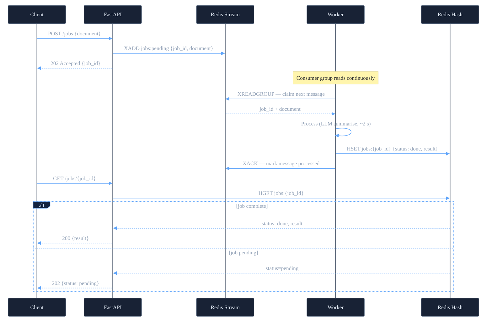

# Message Queue Architecture

## Request flow



The client gets a 202 immediately. The worker processes asynchronously. The client polls until the status is `done`.

## Local deployment topology

**Layers:** Public entry → Docker network only

```mermaid
%%{init: {
    "theme": "base",
    "themeVariables": {
        "fontFamily": "Geist, ui-sans-serif, system-ui, sans-serif",
        "fontSize": "14px",
        "background": "#0b1220",
        "lineColor": "#64748b",
        "textColor": "#e5edf7",
        "primaryTextColor": "#e5edf7",
        "edgeLabelBackground": "#0b1220",
        "clusterBkg": "#111827",
        "clusterBorder": "#334155"
    },
    "flowchart": {
        "curve": "bumpX",
        "htmlLabels": true,
        "nodeSpacing": 36,
        "rankSpacing": 58,
        "padding": 18
    }
}}%%
flowchart TB
    client("<b>Client</b><br/>public caller")

    subgraph public[" "]
        api("<b>FastAPI API</b><br/>localhost:8082")
    end

    subgraph private[" "]
        stream("<b>Redis Stream</b><br/>jobs:pending")
        results("<b>Redis Hash</b><br/>jobs:{id}")
        worker("<b>Worker</b><br/>consumer group: workers")
        llm("<b>Mock LLM</b><br/>summarisation service")
    end

    client --> api
    api --> stream
    api --> results
    stream --> worker
    worker --> llm
    worker --> results

    classDef defaultNode fill:#182235,stroke:#64748b,stroke-width:1.5px,color:#e5edf7
    classDef edgeNode fill:#132340,stroke:#60a5fa,stroke-width:1.75px,color:#dbeafe
    classDef focusNode fill:#2563eb,stroke:#93c5fd,stroke-width:2px,color:#ffffff
    classDef stateNode fill:#111827,stroke:#60a5fa,stroke-width:1.5px,color:#dbeafe
    classDef costNode fill:#3b1d5c,stroke:#a78bfa,stroke-width:1.75px,color:#ede9fe

    class client defaultNode
    class api edgeNode
    class stream,results stateNode
    class worker focusNode
    class llm costNode

    style public fill:#0f1d35,stroke:#315a91,stroke-width:1.5px
    style private fill:#111827,stroke:#334155,stroke-width:1.5px

    linkStyle 0,1,2 stroke:#60a5fa,stroke-width:2px
    linkStyle 3,4,5 stroke:#64748b,stroke-width:1.5px
```



Only the FastAPI service exposes a host port. Redis, the worker, and the mock LLM remain on the private Docker network.

## Responsibility boundary

| Component | Owns |
| --- | --- |
| **FastAPI API** | Accept submissions, return 202, serve poll results |
| **Redis Stream** | Buffer jobs in order, track which are claimed vs done |
| **Worker** | Claim jobs, call LLM, write results, acknowledge |
| **Redis Hash** | Store job status and results for polling |

## What is a Redis Stream?

A Redis Stream is an append-only log — like orders written on a whiteboard in sequence. Nobody erases an order when it's claimed; the worker just marks it done.

The three commands that matter:

| Command | Who calls it | What it does |
| --- | --- | --- |
| `XADD` | API | Appends a new job to the end of the stream |
| `XREADGROUP` | Worker | Claims the next unclaimed entry ("give me the next job") |
| `XACK` | Worker | Marks the entry processed ("I'm done with job #123") |

The worker is not "pushed" to — it sits in a loop calling `XREADGROUP` with a block timeout: "give me the next job, and if there isn't one, wait up to 2 seconds then return empty." The stream never contacts the worker.

**Why not a plain Redis list?** A list (`LPUSH`/`RPOP`) deletes the entry the moment it's read. If the worker crashes after reading but before finishing, the job is gone — no re-delivery possible. A stream keeps every entry until explicitly acknowledged. A crashed worker leaves its entry as "claimed but unacknowledged"; another worker can reclaim it after a timeout.

## Why a separate result store?

The stream is a log of pending work; it is not designed for random access by job ID. The result store (`Redis Hash keyed by job_id`) provides O(1) lookup by the client. The two data structures serve different access patterns:

```text
Stream:      sequential consumption by workers — FIFO, append-only
Result hash: random read by job ID — O(1) GET by clients
```

## Job lifecycle

```text
submitted  →  pending  →  processing  →  done
                                     ↘  failed
```

| State | Where stored | Meaning |
| --- | --- | --- |
| `pending` | Stream (message present) | Job is waiting for a worker |
| `processing` | Stream (message claimed, unacknowledged) | A worker has claimed the job |
| `done` | Result hash | Worker completed successfully |
| `failed` | Result hash | Worker caught an error; result contains the reason |

## Response behavior

Accepted (job submitted):

```http
HTTP/1.1 202 Accepted
{"job_id": "a3f8b2c1-...", "status": "pending"}
```

Polling — still processing:

```http
HTTP/1.1 202 Accepted
{"job_id": "a3f8b2c1-...", "status": "pending"}
```

Polling — complete:

```http
HTTP/1.1 200 OK
{"job_id": "a3f8b2c1-...", "status": "done", "result": "...summary..."}
```

Clients should implement exponential backoff between polls (e.g., 0.5 s, 1 s, 2 s, 4 s) rather than tight polling loops.
