# Scaled Message Queue Architecture

The local example uses a single Redis Stream and one worker process. At production scale, those become multiple purpose-specific queues, worker fleets sized per job type, and managed queue services.

**Layers:** Public entry → Queue tier → Worker fleet → Storage and downstream

Queue tier (blue borders) → Worker fleet (purple) → Storage. Dead letter queue (red) receives messages that exhaust retries. Monitoring receives async signals from all layers.

```mermaid
%%{init: {
    "theme": "base",
    "themeVariables": {
        "fontFamily": "Geist, ui-sans-serif, system-ui, sans-serif",
        "fontSize": "14px",
        "background": "#0b1220",
        "lineColor": "#64748b",
        "textColor": "#e5edf7",
        "primaryTextColor": "#e5edf7",
        "edgeLabelBackground": "#0b1220",
        "clusterBkg": "#111827",
        "clusterBorder": "#334155"
    },
    "flowchart": {
        "curve": "basis",
        "htmlLabels": true,
        "nodeSpacing": 34,
        "rankSpacing": 62,
        "padding": 18
    }
}}%%
flowchart TB
    clients("<b>Clients</b>")
    apis("<b>API replicas</b><br/>submit jobs, serve polls")

    subgraph queueTier[" "]
        inferenceQ("<b>Inference queue</b><br/>LLM completions<br/>priority: high")
        embedQ("<b>Embedding queue</b><br/>batch embed jobs<br/>priority: medium")
        ingestQ("<b>Ingestion queue</b><br/>document processing<br/>priority: low")
        dlq("<b>Dead letter queue</b><br/>failed jobs after retries")
    end

    subgraph workerFleet[" "]
        inferenceWorkers("<b>Inference workers</b><br/>GPU-attached, small fleet")
        embedWorkers("<b>Embedding workers</b><br/>CPU, horizontal scale")
        ingestWorkers("<b>Ingestion workers</b><br/>CPU, horizontal scale")
    end

    resultStore("<b>Result store</b><br/>Redis / DynamoDB<br/>job status and results")
    vectorStore("<b>Vector store</b><br/>indexed chunks")
    monitor("<b>Monitoring</b><br/>queue depth, worker lag,<br/>DLQ size")

    clients --> apis
    apis --> inferenceQ
    apis --> embedQ
    apis --> ingestQ

    inferenceQ --> inferenceWorkers
    embedQ --> embedWorkers
    ingestQ --> ingestWorkers

    inferenceWorkers --> resultStore
    embedWorkers --> resultStore
    ingestWorkers --> vectorStore

    inferenceQ -. retry exhausted .-> dlq
    embedQ -. retry exhausted .-> dlq
    ingestQ -. retry exhausted .-> dlq

    apis -.-> monitor
    inferenceQ -.-> monitor
    embedQ -.-> monitor
    ingestQ -.-> monitor
    dlq -.-> monitor

    classDef entryNode fill:#182235,stroke:#64748b,stroke-width:1.5px,color:#e5edf7
    classDef focusNode fill:#2563eb,stroke:#93c5fd,stroke-width:2px,color:#ffffff
    classDef queueNode fill:#111827,stroke:#60a5fa,stroke-width:1.5px,color:#dbeafe
    classDef costNode fill:#3b1d5c,stroke:#a78bfa,stroke-width:1.75px,color:#ede9fe
    classDef dlqNode fill:#1f1215,stroke:#f87171,stroke-width:1.5px,color:#fecaca
    classDef asyncNode fill:#182235,stroke:#64748b,stroke-width:1.5px,stroke-dasharray:5 4,color:#94a3b8

    class clients,resultStore,vectorStore entryNode
    class apis focusNode
    class inferenceQ,embedQ,ingestQ queueNode
    class inferenceWorkers,embedWorkers,ingestWorkers costNode
    class dlq dlqNode
    class monitor asyncNode

    style queueTier fill:#111827,stroke:#334155,stroke-width:1.5px
    style workerFleet fill:#111827,stroke:#334155,stroke-width:1.5px
```



## Separate queues for separate job types

A single queue mixes slow GPU jobs with fast CPU jobs. A long-running document ingestion job blocks the queue for lower-latency inference requests. Separate queues allow independent scaling and prioritisation:

| Queue | Worker type | Scale trigger | Typical job time |
| --- | --- | --- | --- |
| Inference | GPU instance | Queue depth > 10 | 1–30 s |
| Embedding | CPU instance | Queue depth > 50 | 100–500 ms |
| Document ingestion | CPU instance | Queue depth > 100 | 5–60 s |

## Managed queue services

At production scale, operating a Redis Stream cluster adds infrastructure overhead. Managed queue services handle durability, replication, and scaling:

| Service | Model | Notable for |
| --- | --- | --- |
| **AWS SQS** | Point-to-point | Simple, serverless, scales to millions of messages/s; standard or FIFO delivery |
| **AWS SQS + SNS** | Fan-out pub/sub | Fan a single event to multiple queues (e.g., "new document" → embed queue + ingest queue) |
| **Google Pub/Sub** | Pub/sub | Global delivery, at-least-once, replay within retention window |
| **Azure Service Bus** | Point-to-point | Sessions for ordered delivery; built-in DLQ |
| **Kafka** | Partitioned log | High-throughput event streaming; consumers track their own offsets |
| **Redis Streams** | Partitioned log | Low-latency, operational simplicity if Redis is already in the stack |

For most AI backend workloads, SQS is the default on AWS and Pub/Sub on GCP — both are serverless, require no infrastructure management, and integrate directly with auto-scaling worker fleets.

## Dead letter queues

A message that fails repeatedly — because the document is malformed, the LLM API is returning errors, or the worker is hitting an unhandled exception — must not re-enter the main queue indefinitely. After a configurable number of delivery attempts (typically 3–5), move the message to a dead letter queue.

```text
Main queue → worker fails → retry (attempt 2) → worker fails → retry (attempt 3)
  → worker fails again → DLQ
```

The DLQ is:
- **An alerting trigger:** DLQ depth > 0 pages on-call.
- **An audit log:** failed messages are preserved for inspection and replay.
- **A circuit break:** stops poisoned messages from consuming worker capacity.

After fixing the root cause, replay DLQ messages back into the main queue.

## Auto-scaling worker fleets

Workers scale horizontally — add more consumers to drain a growing queue faster. The scaling signal is queue depth (number of pending messages), not CPU or memory.

```text
Queue depth < 5    → 1 worker replica  (steady state)
Queue depth 5–20   → 2–4 replicas      (moderate load)
Queue depth > 20   → scale out fast    (burst)
Queue depth = 0    → scale in slowly   (avoid thrashing)
```

On Kubernetes, KEDA (Kubernetes Event-Driven Autoscaling) provides native queue-depth-based scaling for SQS, Pub/Sub, Redis Streams, and Kafka without custom metrics pipelines.

GPU worker fleets require separate consideration: GPU nodes take 2–5 minutes to provision, so scale-out decisions must be proactive (predict queue depth rather than react to it) and scale-in must be conservative (avoid releasing expensive GPU capacity prematurely).

## Priority queues

Standard queues are FIFO — every job waits equally. AI systems often need priority:

- Paid users should not wait behind batch jobs.
- Interactive requests (chat completions) should not wait behind offline document processing.
- Retry attempts should not starve new jobs.

Implement priority as separate queues with separate worker pools:

```text
High-priority queue  → dedicated workers — always drained first
Standard queue       → shared workers    — drained when high queue is empty
Batch queue          → low-priority workers — only when both above are empty
```

Some managed services (SQS FIFO with message groups, Azure Service Bus sessions) support priority natively. Redis Streams support it only by convention — use separate stream keys per priority level.

## Observability

Track at minimum:

| Metric | Why it matters |
| --- | --- |
| Queue depth (per queue) | Primary auto-scale signal and user-visible latency indicator |
| Message age (oldest unprocessed) | Catches stuck workers better than depth alone |
| Worker processing rate (jobs/s) | Validates that worker count matches throughput demand |
| DLQ depth | Immediate alert on repeated failures |
| Job end-to-end latency (p50, p99) | What users actually experience — from submission to result |
| Acknowledgement rate vs delivery rate | Unacknowledged messages are at risk of re-delivery |

## Failure behavior

| Failure | Impact | Mitigation |
| --- | --- | --- |
| Worker crashes mid-job | Message stays unacknowledged; reclaimed after visibility timeout | Consumer group pending entry recovery; DLQ after max retries |
| Queue service unavailable | Job submissions fail; API returns 503 | Circuit breaker on queue writes; retry submissions with backoff |
| Result store unavailable | Workers cannot save results; jobs are re-processed on restart | Write result before acknowledging message |
| LLM API rate-limited | Workers back up; queue depth grows | Exponential backoff in worker; queue depth alert to reduce submission rate |

## Write result before acknowledge

This ordering matters:

```text
Correct:    process → write result → XACK
Incorrect:  process → XACK → write result
```

If the worker acknowledges before writing, a crash between ack and write means the result is lost and the message will not be re-delivered. Writing the result first ensures that a crash before ack causes harmless re-processing (the second write is idempotent if keyed on job_id).
