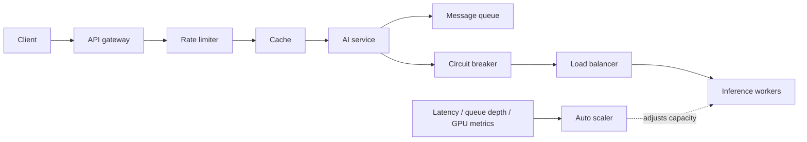

# System Design for AI Engineers

This folder is a learning curriculum for seven production system-design patterns that repeatedly appear in AI engineering systems and interviews.

The learning path was inspired by Shirin Khosravi Jam's article, [System Design for AI Engineers: 7 patterns you should know in your interviews](https://jamwithai.substack.com/p/system-design-for-ai-engineers-7). The article provides the syllabus and AI-specific interview framing. The explanations, Mermaid diagrams, runnable examples, and deeper implementation notes in this repository are independently written.

The goal is not only to recognize each pattern. Each module should make it possible to explain the pattern, run a small implementation, identify its failure modes, and describe how it changes at production scale.

## Learning path

| Module | Pattern | AI engineering question it answers | Status |
| --- | --- | --- | --- |
| `01-api-gateway/` | API gateway | How does a request enter the system, get authenticated, and reach the correct AI service? | In progress |
| `02-rate-limiting/` | Rate limiting | How do we prevent one caller from exhausting model capacity or budget? | Implemented |
| `03-caching/` | Caching | How do we avoid repeating expensive embedding, retrieval, or generation work? | Planned |
| `04-message-queues/` | Message queues | How do we absorb bursts and process long-running AI work asynchronously? | Planned |
| `05-circuit-breakers/` | Circuit breakers | How do we stop a degraded model provider or vector store from causing a cascading failure? | Planned |
| `06-load-balancing/` | Load balancing | How do we distribute variable-cost inference requests across healthy instances? | Planned |
| `07-auto-scaling/` | Auto scaling | How do we add and remove expensive compute using AI-relevant demand signals? | Planned |

## Module structure

Each module follows the same progression where the material is useful:

| File or directory | Purpose |
| --- | --- |
| `0_readme.md` | What the pattern does, why it matters for AI systems, the mental model, and how to run the example. |
| `1_architecture.md` | Local request flow, component boundaries, and original Mermaid diagrams. |
| `2_architecture_scaled.md` | A production-style extension and the new trade-offs introduced by scale. |
| `3_terminology.md` | Important terms grouped by the questions they answer. |
| `4_detailed_concepts.md` | Algorithms, failure modes, design choices, and interview-level depth. |
| `5_worked_example.ipynb` | An interactive walkthrough where a notebook adds learning value. |
| `app/` or `src/` | Small implementation that exposes the mechanism instead of hiding it behind a framework. |
| `docker-compose.yml` | Reproducible local stack for the module. |
| `deploy/` | Deployment notes or manifests when they add useful production context. |

## Questions every module should answer

1. **Purpose:** What problem does this pattern solve?
2. **AI relevance:** What is different or unusually important for AI workloads?
3. **Request flow:** Where does the pattern sit and what decisions does it make?
4. **Runnable mechanism:** Can we observe the pattern working and failing locally?
5. **State and scale:** What state must be shared when replicas are added?
6. **Failure behavior:** What happens when this component or a dependency fails?
7. **Trade-offs:** What does the pattern cost, and when should it not be used?
8. **Interview signal:** Can we explain the design under a realistic system-design prompt?
9. **Connections:** How does it interact with the other six patterns?

## End-to-end mental model

The seven modules eventually combine into one production request path:

The modules isolate one pattern at a time for learning. Real systems combine them, and the boundaries may be implemented by managed cloud services, proxies, application code, or orchestration platforms.

## Design principles for the examples

- Start with a small, observable local system before showing the scaled design.
- Prefer open-source components and ordinary application code so the mechanism is visible.
- Use AI-specific workloads, costs, metrics, and failure modes.
- Create original diagrams and explanations; link to external sources for further reading.
- Treat the examples as learning systems, not drop-in production configurations.
